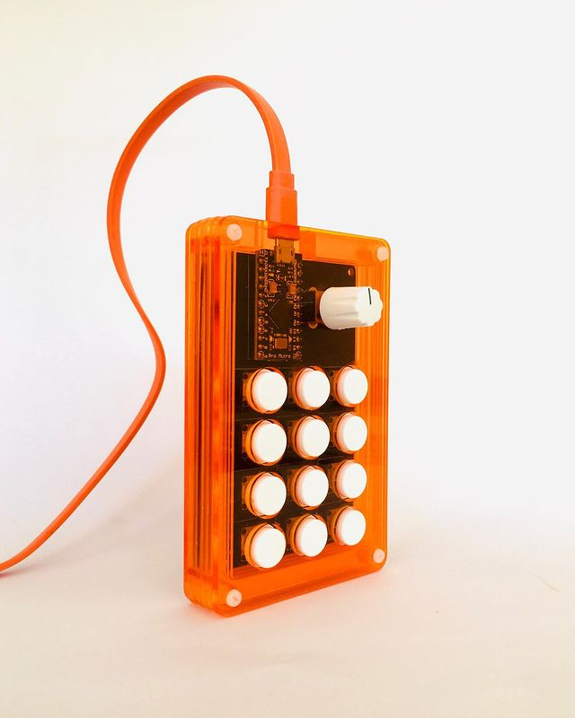

# Holomate VSCODE Macros

This is a vscode extension that allows you to create macros for your projects using Holomate.
[HOLOMATE]([https://](https://www.instagram.com/holomate_))

## Features

- Create macros for your projects
- Run macros from the command palette

